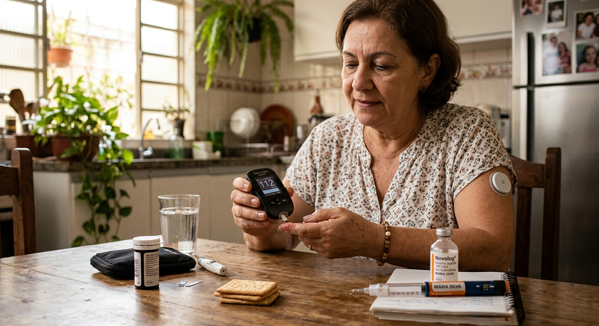

# Análise estatística de base de dados de diabetes



Projeto de Ciência de Dados focado na análise exploratória (EDA) e inferência estatística de indicadores de saúde pública para a identificação de fatores de risco relacionados ao diabetes, utilizando o dataset BRFSS 2015.

O diabetes é uma doença crônica grave na qual os indivíduos perdem a capacidade de regular efetivamente os níveis de glicose no sangue e pode levar a uma redução na qualidade de vida e na expectativa de vida.

O Sistema de Vigilância de Fatores de Risco Comportamentais (BRFSS) é uma pesquisa telefônica relacionada à saúde que é coletada anualmente pelo CDC (Centro de Controle e Prevenção de Doenças dos Estados Unidos). A cada ano, a pesquisa coleta respostas de milhares de americanos sobre comportamentos de risco relacionados à saúde, condições crônicas de saúde e o uso de serviços preventivos. Para este projeto, foi utilizado conjunto de dados disponível no Kaggle para o ano de 2015.

https://www.kaggle.com/datasets/alexteboul/diabetes-health-indicators-dataset

## Organização do projeto

```
├── Anotações          <- Minhas anotações que realizei no projeto com passo a passo.
├── .gitignore         <- Arquivos e diretórios a serem ignorados pelo Git
├── ambiente.yml       <- O arquivo de requisitos para reproduzir o ambiente de análise
├── LICENSE            <- Licença de código aberto (MIT)
├── README.md          <- README principal para desenvolvedores que usam este projeto.
|
├── dados              <- Arquivos de dados para o projeto.
|
├── notebooks          <- Cadernos Jupyter.
│
|   └──src             <- Código-fonte para uso neste projeto.
|      │
|      ├── __init__.py  <- Torna um módulo Python
|      ├── config.py    <- Configurações básicas do projeto
|      └── estatistica.py  <- funções criadas especificamente para este projeto
|
├── referencias        <- Dicionários de dados.
|
├── relatorios         <- Análises geradas em HTML, PDF, LaTeX, etc.
│   └── imagens        <- Gráficos e figuras gerados para serem usados em relatórios
```

## Configuração do ambiente

1. Faça o clone do repositório que será criado a partir deste modelo.

    ```bash
    git clone ENDERECO_DO_REPOSITORIO
    ```

2. Crie um ambiente virtual para o seu projeto utilizando o gerenciador de ambientes de sua preferência.

    ```bash
    conda env export > ambiente.yml
    ```
## Um pouco mais sobre a base

[Clique aqui](referencias/01_dicionario_de_dados.md) aqui para ver o dicionario de dados da base ultlizada.

## Resumo dos principais resultados
Correlações Positivas Fortes:

SaudeGeral (0.41): Existe uma correlação positiva moderada a forte. Isso sugere que, à medida que a saúde geral da pessoa tende a ser pior (valores maiores, conforme seu dicionário de variáveis), a chance de ter diabetes aumenta. Isso é consistente com sua observação anterior de que quem tem diabetes tende a ter uma saúde geral mais baixa.
DificuldadeAndar (0.27): Uma correlação positiva que indica que pessoas com dificuldade para andar têm maior probabilidade de ter diabetes.
FaixaIdade (0.26): Uma correlação positiva que reforça a ideia de que a prevalência de diabetes aumenta com a idade.
Correlações Negativas Fortes:

Ensino (-0.17): Uma correlação negativa moderada. Isso sugere que quanto maior o nível de escolaridade, menor a probabilidade de ter diabetes. Isso se alinha com a observação que você fez sobre ensino e saúde geral.
FaixaRenda (-0.23): Uma correlação negativa moderada. Pessoas com faixas de renda mais altas tendem a ter menor probabilidade de ter diabetes, o que também foi uma das suas conclusões ao analisar os histogramas.
Outras Correlações: Variáveis como ColesterolAlto (0.29), ProblemaCardiaco (0.21) e AVC (0.13) também mostram correlações positivas com 'Diabetes', embora ligeiramente mais fracas que as citadas acima, mas ainda relevantes. Variáveis como AtividadeFisica (-0.16), ComeFrutas (-0.05) e ComeVegetais (-0.08) mostram correlações negativas, indicando que a prática de atividades físicas e o consumo de frutas/vegetais estão associados a uma menor chance de diabetes
